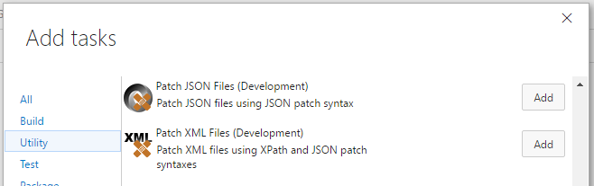

# Build and release tasks for File Patch

Visual Studio Team Services Build and Release Management extensions that help you update files using JSON patch and similar syntax.

[Learn more](https://github.com/geeklearningio/gl-vsts-tasks-file-patch/wiki) about this extension on the wiki!

## Tasks included

* **[Patch JSON Files](https://github.com/geeklearningio/gl-vsts-tasks-file-patch/wiki/Patch-JSON-Files)**: Patch JSON files using JSON patch syntax
* **[Patch XML Files](https://github.com/geeklearningio/gl-vsts-tasks-file-patch/wiki/Patch-XML-Files)**: Patch XML files using XPath and JSON patch syntaxes
* **[Patch YAML Files](https://github.com/geeklearningio/gl-vsts-tasks-file-patch/wiki/Patch-YAML-Files)**: Patch YAML files using JSON patch syntax

## Steps

After installing the extension, you can add one (or more) of the tasks to a new or existing [build definition](https://www.visualstudio.com/en-us/docs/build/define/create) or [release definition](https://www.visualstudio.com/en-us/docs/release/author-release-definition/more-release-definition)

## Learn more

The [source](https://github.com/geeklearningio/gl-vsts-tasks-file-patch) for this extension is on GitHub. Take, fork, and extend.

## Release Notes

> **10-7-2016**
> - Added: Patch YAML File

> **8-3-2016**
> - Added: Patch JSON File
> - Added: Patch XML File
